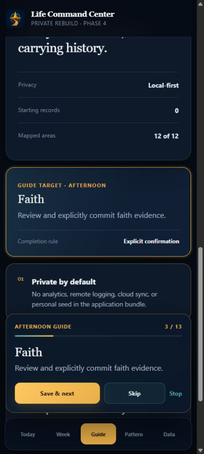

# Phase 4 Report — App Shell, Navigation, Guides, and Automation

## Result

Phase 4 is complete against the synthetic/blank-state acceptance gate. The
application now has deterministic time-aware guide behavior, durable guide
sessions, explicit step progression, cross-tab routing, Quick Mode mutual
exclusion, Smart Check-In gating, guide badges, local autosave, and fixed mobile
navigation.

No legacy source, real profile, backup, history, or personal screenshot is
present in the repository.

## Delivered behavior

- sticky top status, the complete 12-tab rail, and fixed five-action mobile
  navigation;
- Morning, Afternoon, Evening, missed-Morning, Smart Check-In, and Weekly
  guide families;
- a data-driven, typed registry with conditional targets, target IDs, routing
  effects, completion rules, optionality, and priority;
- application-time-zone period, forecast-window, effective-day, and week-key
  functions with an injected clock;
- due/late/held/stale private-follow-up classification without inferred events;
- deterministic ordered step construction and a Today fallback for an
  otherwise-empty guide;
- a durable session state machine with Next, Skip, Stop, completion badges,
  manual override, stale cleanup, and completion anti-reopen behavior;
- Smart Check-In prerequisite/range 60-minute gates and a three-step cap;
- Quick Mode and full-guide mutual exclusion;
- target focus, highlight, scroll, and recoverable unavailable-target errors;
- one automation owner with idempotent timer registration and explicit cleanup;
- verified localStorage + IndexedDB autosave through the Phase 3 storage
  coordinator; and
- reload recovery of the active tab, guide session, current step, and badges.

## Automated evidence

- 70 tests pass across 14 files.
- 44 Phase 4 cases cover:
  - midnight, 3:59 AM, 4:00 AM, 4:59 AM, 5:00 AM, 11:59 AM, noon, 4:59 PM,
    5:00 PM, and all forecast-window boundaries;
  - 4 AM, midnight, and manual-start rollover behavior;
  - Sunday/Monday weekly eligibility and completion suppression;
  - missed-morning eligibility and suppression;
  - all full-guide orders, conditional Saturday/private steps, and the
    empty-guide fallback;
  - Smart Check-In gates and the three-step cap;
  - Next, Skip, Stop, atomic completion, Quick Mode exclusion, manual override,
    and stale recovery;
  - route success and unavailable-target recovery;
  - automation deduplication/cleanup and visibility recomputation; and
  - UI routing, Quick Mode, local recovery, and reload resume.
- TypeScript strict checking and the production PWA build pass.
- Phase 1–4 contract verifiers pass.
- The privacy scan passes before and after the build.
- Dependency audit reports 0 vulnerabilities.

## Working-browser evidence

Tested at a 412 × 915 captured mobile frame with synthetic blank state:

- guide launch created a 13-step Afternoon session;
- reload resumed the active session and Life Checks target;
- two explicit Next transitions routed from Today to the Faith tab and
  highlighted the Faith target;
- guide badge, overlay progress, Next, Skip, Stop, and bottom navigation were
  visible;
- browser diagnostics contained no warning or error entries; and
- the committed screenshot contains no real personal data.

## Privacy and deployment

- Repository visibility remains private.
- Deployment remains disabled by the controlling privacy gate.
- The local application writes only browser-local state and has no analytics,
  telemetry, cloud sync, or remote state logging.
