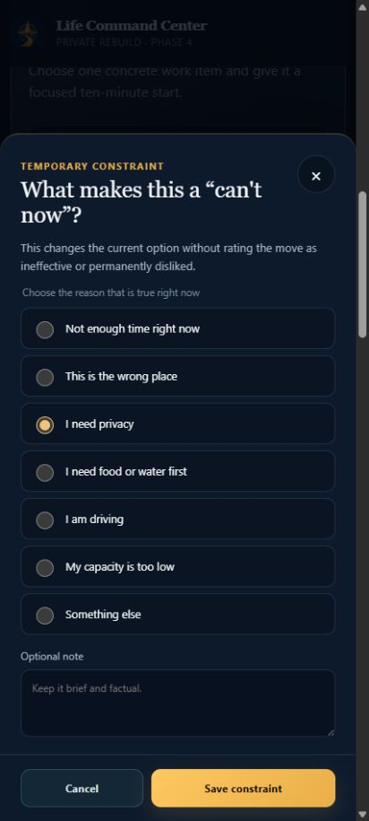

# Phase 5 Report — Today, Minimum Wins, and Move Lifecycle

## Result

Phase 5 is complete against the synthetic/blank-state gate. Today is now a
command layer rather than a generic dashboard: it distinguishes unknown
evidence, explains the best next action, responds safely to current context,
maintains exactly three whole-day Minimum Wins, and supports the full
single-move lifecycle.

No real profile, history, note, backup, export, or personal screenshot is
present in the repository.

## Delivered behavior

- eight two-point Today Score categories: Energy, Career, Money, Fatherhood,
  Health, Social/Love, Home Reset, and Emotional Control;
- unknown, explicit-false, logged, auto-observed, inferred, and trusted source
  states without converting missing evidence into failure;
- evidence-aware score display/qualification and no-shame direction language;
- deterministic Today Command with readiness, confidence, main limiter, best
  next fix, expected effect, check window, lane, and reason trace;
- Home, Work, Driving, Public, and Outside contexts;
- a non-interactive driving-safety command and disabled primary action while
  Driving is selected;
- Why this command, Try this, Can't now, Try another, Done, Undo, Pause here,
  Resume, and Another after completion;
- one active move, start/update/completion timestamps, same-period display
  lock, new-period release, and delayed effect-check surface;
- structured temporary Can't now constraints with reason, optional note,
  context, expiration, management/undo semantics, and no false negative
  effectiveness outcome;
- exactly three deterministic, versioned whole-day Minimum Wins with Protect,
  Future, and Connection balance;
- recovery/support substitution, manual Done versus automatic Covered, proof
  source, expansion details, move-linked coverage, and coverage undo;
- one readiness-ladder movement surface; Fitbod retains exact exercise,
  set/rep, and equipment prescription; and
- canonical localStorage + IndexedDB autosave through the shared coordinator.

## Automated evidence

- 91 tests pass across 18 files.
- 21 Phase 5 cases cover:
  - score visibility, explicit zero versus unknown, eight-category maximum, and
    readiness;
  - driving command replacement, conservative missing-evidence language,
    candidate determinism, constraint gating, and the single movement boundary;
  - exactly three balanced Minimum Wins, support substitution, manual/covered
    distinction, coverage undo, and unrelated-checkbox rejection;
  - single active move, pause/resume, Done/Undo, display-lock release, Can't
    now, constraint undo, Try another, and delayed effect capture; and
  - integrated Today Score entry, driving UI, active move controls, and the
    readable reason sheet.
- Strict TypeScript checking and production PWA build pass.
- Phase 1–5 verifiers pass.
- Privacy scans pass before and after the build.
- Dependency audit reports 0 vulnerabilities.

## Working-browser and zoom evidence

Fresh-browser mobile checks used synthetic local state:

- the Today screen exposed all eight evidence groups, five contexts, the
  command trace, exactly three wins, and support lanes;
- Driving changed the command to **Protect the drive** and disabled the primary
  action with **Park to update**;
- Try this → Pause here → Resume → Done → Undo passed;
- Can't now opened a normal-radio, opaque-background, wrapping-label sheet;
- selecting **I need privacy** and saving created a temporary constraint without
  an effectiveness outcome;
- at a 206 CSS-pixel content width (the 200% layout equivalent of a 412-pixel
  phone), neither the page nor sheet had horizontal overflow, and every reason
  plus the sticky actions remained accessible; and
- the final fresh-browser boot produced no warning or error console entries.

## Privacy and deployment

- Repository visibility remains private.
- Deployment remains disabled by the controlling privacy gate.
- All state stays browser-local; analytics, telemetry, cloud sync, and remote
  user-state logging remain absent.
